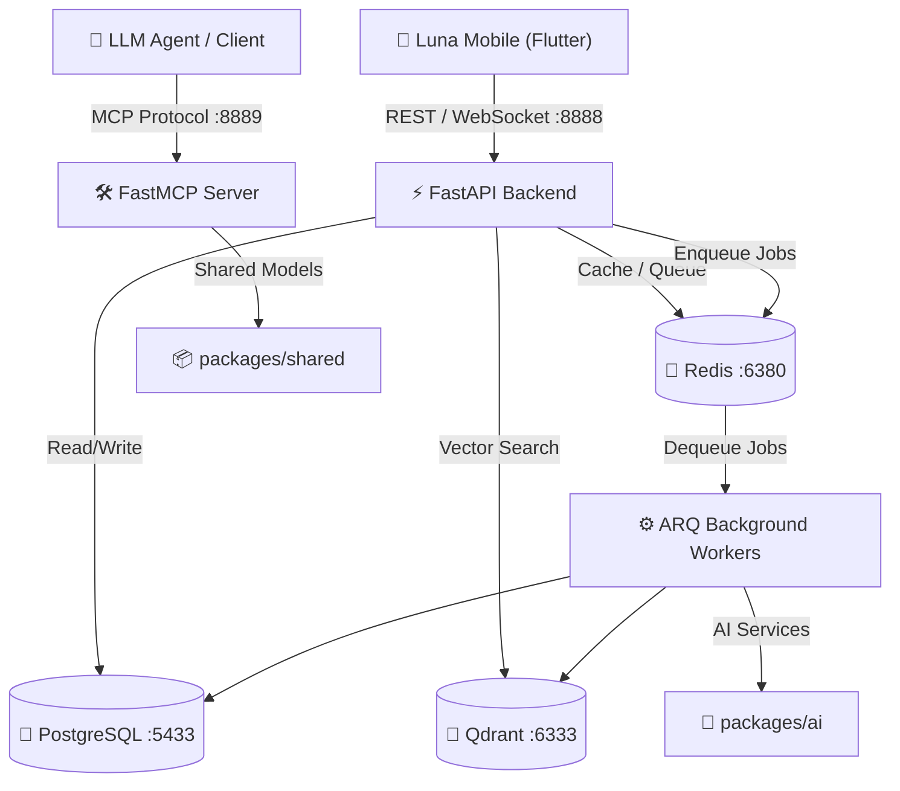

# Luna AI — Monorepo Architecture

Production-oriented monorepo architecture for the **Luna AI** voice assistant and emotional counseling application.

---

## 1. 📁 Repository Structure

```text
.
├── apps/
│   ├── luna_mobile/             # Flutter mobile application (UI, Clean Architecture, Riverpod)
│   │
│   └── backend/
│       ├── api/                # FastAPI application server (REST, WebSocket, Auth, Sessions)
│       │   ├── app/
│       │   │   ├── api/        # Routes & dependencies
│       │   │   ├── core/       # Logging & config
│       │   │   ├── models/     # SQLAlchemy 2.x models
│       │   │   ├── schemas/    # Pydantic v2 schemas
│       │   │   ├── services/   # Application domain services
│       │   │   └── main.py     # FastAPI entry point
│       │   ├── migrations/     # Alembic database migrations
│       │   ├── tests/          # Pytest suite for API
│       │   ├── pyproject.toml
│       │   └── Dockerfile
│       │
│       ├── mcp/                # FastMCP AI tool/context server (Model Context Protocol)
│       │   ├── app/
│       │   │   ├── tools/      # MCP tools exposed to LLM
│       │   │   ├── resources/  # MCP resources
│       │   │   ├── services/   # Internal tool services
│       │   │   └── main.py     # FastMCP entry point
│       │   ├── tests/          # Pytest suite for MCP
│       │   ├── pyproject.toml
│       │   └── Dockerfile
│       │
│       └── workers/            # ARQ async Redis background workers
│           ├── app/
│           │   ├── tasks/      # Background task definitions (Summarization, Risk, Emotion)
│           │   ├── workers/    # ARQ WorkerSettings
│           │   └── main.py     # Worker entry point
│           ├── tests/          # Pytest suite for workers
│           ├── pyproject.toml
│           └── Dockerfile
│
├── packages/
│   ├── shared/                 # Shared domain types, config, errors, DB connections
│   │   ├── config.py
│   │   ├── database.py
│   │   ├── errors.py
│   │   ├── types.py
│   │   └── pyproject.toml
│   │
│   └── ai/                     # AI provider interfaces, RAG, emotion detection, orchestrator
│       ├── interfaces/
│       ├── orchestration/
│       ├── services/
│       ├── vector_store/
│       └── pyproject.toml
│
├── scripts/                    # Development & Docker automation scripts
│   ├── docker-dev.sh / .ps1    # Automated Docker dev setup + auto-migration & seeding
│   ├── dev.sh / .ps1           # Local Python services launcher
│   ├── setup.sh / .ps1         # Virtual environment & package installation
│   ├── seed.py                 # Initial database seeder script
│   └── DOCKER_SETUP.md         # Detailed Docker documentation
│
├── tests/                      # Global & POC test suites
│   ├── test_emotion/           # Speech Emotion Recognition (emotion2vec_plus_large) POC
│   └── test_ai_providers.py    # Integration test for AI LLM providers
│
├── docs/                       # Architecture diagrams & business logic specs
├── .env.example                # Environment variables template
├── docker-compose.yml          # Local multi-service Docker setup
├── ruff.toml                   # Root linting & formatting rules
└── README.md                   # Project overview & documentation
```

---

## 2. 🏛️ Core Architecture Overview

| Component | Technology | Primary Role & Responsibilities |
| :--- | :--- | :--- |
| **FastAPI Backend** | Python 3.11 / FastAPI | Primary API server for mobile clients (REST & WebSocket). Manages auth, sessions, call routing, and enqueues jobs. |
| **FastMCP Server** | FastMCP | Exposes standard Model Context Protocol (MCP) tools and resources to LLMs safely. |
| **ARQ Workers** | ARQ / Redis | Executes async background tasks (e.g., emotion detection, diary synthesis, memory extraction). |
| **PostgreSQL** | PostgreSQL 16 | Relational store for users, conversation logs, call metadata, and application state. |
| **Redis** | Redis 7 | High-performance cache, pub/sub channel for audio streaming, and ARQ task queue storage. |
| **Qdrant** | Qdrant | Vector database for storing and querying long-term semantic memory embeddings. |
| **Flutter Mobile** | Flutter / Riverpod | Mobile application with Clean Architecture and mock/remote data source toggle. |

---

## 3. 🚀 Cara Run (Getting Started Guide)

### 📌 Prerequisites
- **Git**
- **Docker & Docker Compose** (for Docker setup)
- **Python 3.11+** (for local development)
- **Flutter SDK** (for running `luna_mobile`)

---

### 🐳 Metode A: Running via Docker (Direkomendasikan — Cepat & Ringan)

Script otomatis `docker-dev` akan memeriksa berkas `.env`, menjalankan container, melakukan migrasi database (Alembic), dan mengisi data awal (*seeding*):

#### **Linux / macOS:**
```bash
chmod +x scripts/docker-dev.sh
./scripts/docker-dev.sh
```

#### **Windows (PowerShell):**
```powershell
.\scripts\docker-dev.ps1
```

#### **Manual Docker Command:**
```bash
# Copas env jika belum ada
cp .env.example .env

# Jalankan semua service
docker compose up --build
```

#### 🌐 Port Mappings (Docker Host vs Container):
| Service | Host Port | Container Port | Endpoint / URL |
| :--- | :--- | :--- | :--- |
| **FastAPI Backend** | `8888` | `8888` | `http://localhost:8888` |
| **FastMCP Server** | `8889` | `8889` | `http://localhost:8889` |
| **PostgreSQL** | `5433` | `5432` | `localhost:5433` |
| **Redis** | `6380` | `6379` | `localhost:6380` |
| **Qdrant Vector DB** | `6333` | `6333` | `http://localhost:6333` |

> ℹ️ *Detail panduan Docker dapat dibaca di [scripts/DOCKER_SETUP.md](file:///home/mashupsoat/Project/luna_ai/scripts/DOCKER_SETUP.md).*

---

### 💻 Metode B: Running Local Development (Standalone / Hybrid)

Jika ingin menjalankan service secara langsung di lingkungan lokal Python:

1. **Setup Environment & Virtualenv:**
   ```bash
   # Linux/macOS
   ./scripts/setup.sh

   # Windows
   .\scripts\setup.ps1
   ```

2. **Jalankan Service Backend:**
   ```bash
   # Linux/macOS
   ./scripts/dev.sh

   # Windows
   .\scripts\dev.ps1
   ```

3. **Atau Jalankan Service Secara Manual per Terminal:**
   ```bash
   source .venv/bin/activate

   # 1. FastAPI API
   cd apps/backend/api && uvicorn app.main:app --reload --port 8888

   # 2. FastMCP Server
   cd apps/backend/mcp && python -m app.main

   # 3. ARQ Background Worker
   cd apps/backend/workers && arq app.workers.WorkerSettings
   ```

---

### 📱 Metode C: Running Mobile App (Flutter)

Aplikasi Flutter `luna_mobile` dapat dijalankan di **Perangkat Fisik (HP Android via USB Debugging)**, **Emulator**, maupun **Web/Desktop**.

#### **1. Persiapan HP Android (Physical Device) / Emulator:**
- Pastikan HP Android sudah dalam mode **Developer Options** dan **USB Debugging** telah diaktifkan.
- Hubungkan HP ke laptop/PC menggunakan kabel USB, lalu periksa koneksi perangkat:
  ```bash
  adb devices
  ```
  *(Pastikan perangkat muncul di daftar dengan status `device`)*

#### **2. Reverse Port ADB (Wajib untuk HP Fisik & Emulator):**
Agar HP Android atau Emulator dapat mengakses server backend FastAPI lokal (`http://localhost:8888`) secara langsung melalui jaringan USB/loopback:
```bash
# Mengarahkan port 8888 HP ke port 8888 PC (FastAPI Backend)
adb reverse tcp:8888 tcp:8888

# (Opsional) Forwarding port FastMCP jika dibutuhkan
adb reverse tcp:8889 tcp:8889
```

> 💡 **Penjelasan `adb reverse`:** Perintah ini membuat port `localhost:8888` di dalam HP Android meneruskan semua request-nya langsung ke `localhost:8888` di PC/Laptop kamu. Jalankan perintah ini setiap kali kamu menghubungkan ulang kabel USB HP.

#### **3. Menjalankan Aplikasi Flutter:**
```bash
# 1. Masuk ke direktori luna_mobile
cd apps/luna_mobile

# 2. Ambil dependensi package
flutter pub get

# 3. (Opsional) Bersihkan build cache jika ada kendala
flutter clean && flutter pub get

# 4. Jalankan aplikasi ke HP Android / Device
flutter run
```

#### **4. Tombol Pintas Interaktif (`flutter run` CLI):**
- Tekan **`r`** : **Hot Reload** (Pembaruan UI secara instan tanpa mereset halaman)
- Tekan **`R`** : **Hot Restart** (Mereset ulang state aplikasi dari awal)
- Tekan **`c`** : Bersihkan layar terminal log
- Tekan **`q`** : Quit / Keluar dari aplikasi

---

### 🧪 Metode D: Running Tests & POCs

#### **1. Menjalankan Unit/Integration Tests (Pytest):**
```bash
# Test API
pytest apps/backend/api/tests

# Test MCP Tools
pytest apps/backend/mcp/tests

# Test Workers
pytest apps/backend/workers/tests

# Test AI Packages
pytest packages/ai/tests
```

#### **2. Menjalankan POC Speech Emotion Recognition (emotion2vec_plus_large):**
```bash
python3 tests/test_emotion/test_emotion.py
```
*Hasil pengujian emotion recognition akan otomatis ditulis ke [tests/test_emotion/poc_result.md](file:///home/mashupsoat/Project/luna_ai/tests/test_emotion/poc_result.md).*

---

## 4. 🔄 Service Communication Flow



---

## 5. 🛠️ Code Style & Standards

- **Python**: Linter & formatter dikonfigurasi menggunakan [Ruff](https://github.com/astral-sh/ruff) (`ruff.toml`).
- **Clean Architecture**: `luna_mobile` memisahkan lapisan `domain`, `data`, dan `presentation`.
- **Decoupled Packages**: Module `packages/shared` dan `packages/ai` di-install sebagai paket editable (`pip install -e`) agar bisa digunakan bersama oleh `api`, `mcp`, dan `workers`.
