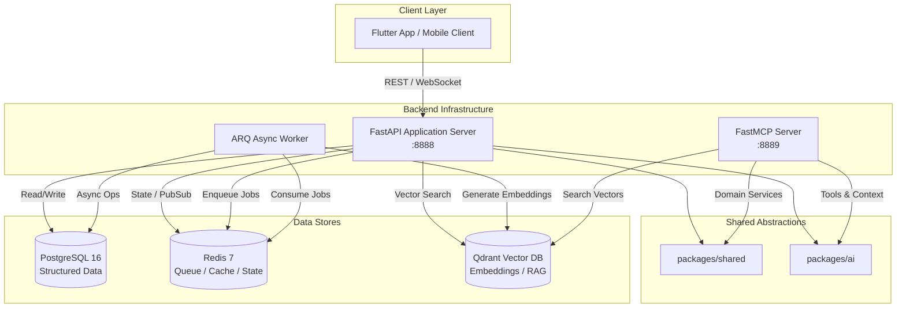

# Luna AI Architecture

This document details the system architecture, component boundaries, and data flow for the Luna AI backend monorepo.

## System Topology & Service Flow

## Service Separation & Responsibilities

### 1. Mobile Application (`apps/luna_mobile`)
- Flutter cross-platform mobile interface.
- Communicates directly with FastAPI for authentication, user profiles, conversation management, call sessions, and streaming audio.

### 2. FastAPI Application Server (`apps/backend/api`)
- Primary application gateway.
- Handles user auth, call sessions, WebSockets, streaming audio coordination, relational state persistence.
- Initiates asynchronous background jobs via Redis queues.
- **Note:** FastAPI does *not* depend on MCP for internal operations.

### 3. FastMCP Server (`apps/backend/mcp`)
- Tool and context provider compliant with Model Context Protocol (MCP).
- Exposes tools like `get_system_status`, `search_memory`, `search_knowledge` for LLM agents.
- Invokes shared application services instead of duplicating business logic.

### 4. Asynchronous Workers (`apps/backend/workers`)
- Backed by **ARQ (Async Redis Queue)**.
- Executes background operations (conversation summarization, memory extraction, emotion analysis, embedding generation).

### 5. Shared Domain Packages (`packages/shared` & `packages/ai`)
- `packages/shared`: Common types, environment settings (`BaseConfig`), database session setup, custom exception hierarchy.
- `packages/ai`: Provider-agnostic abstractions (`BaseLLMProvider`, `BaseTTSProvider`, `BaseSTTProvider`, `BaseVectorStore`), `LLMFactory`, `TTSFactory`, `AIOrchestrator`, `RAGService`.
  - Supports dynamic provider switching via `.env` (`LLM_PROVIDER=openai|gemini|mock`, `TTS_PROVIDER=elevenlabs|openai|mock`).
